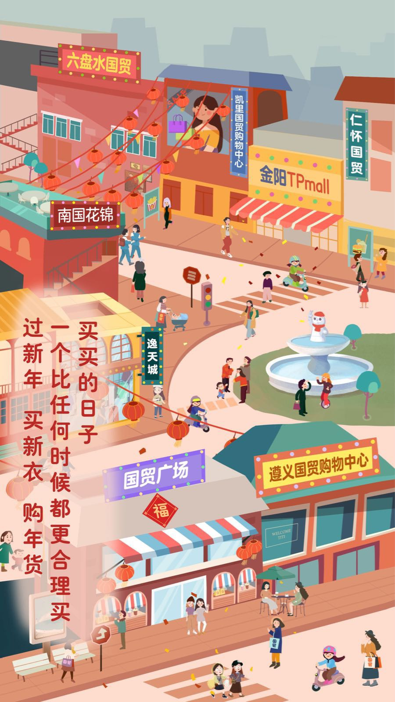

# 基于Pixijs的营销h5

## 扫码查看


## 推荐一个不错的游戏开发框架 sint.js

- API [docs](https://watertian.github.io/sint.js/docs/).
- [demo](https://watertian.github.io/sint-example/).


## 开发框架
- [pixijs](https://pixijs.io/examples/#/basics/basic.js)
- [pixi-tween](https://themoonrat.github.io/pixi-tween/docs/index.html)
- [pixi-particle](http://pixijs.io/pixi-particles/docs/index.html)


## demo
- [火](https://pixijs.io/pixi-particles/examples/flame.html)
- [水](https://www.sucaihuo.com/js/3139.html)

## Usage

#### install

```sh
npm install
```

#### run

```sh
npm run dev
```

#### build

```sh
npm run build
```

## 效果




